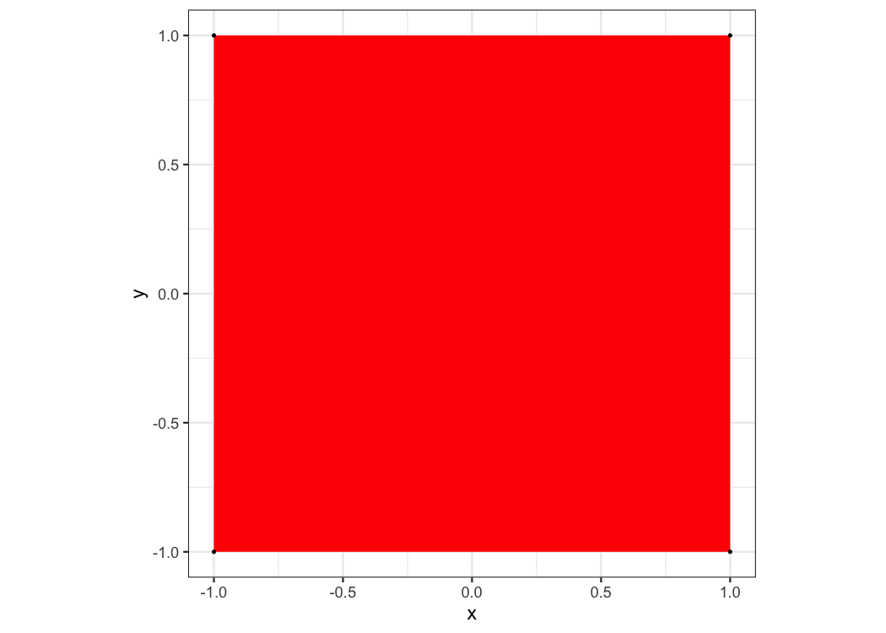
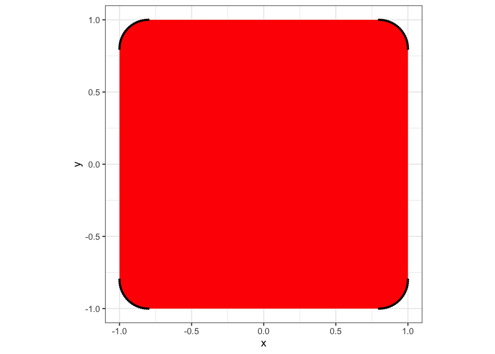
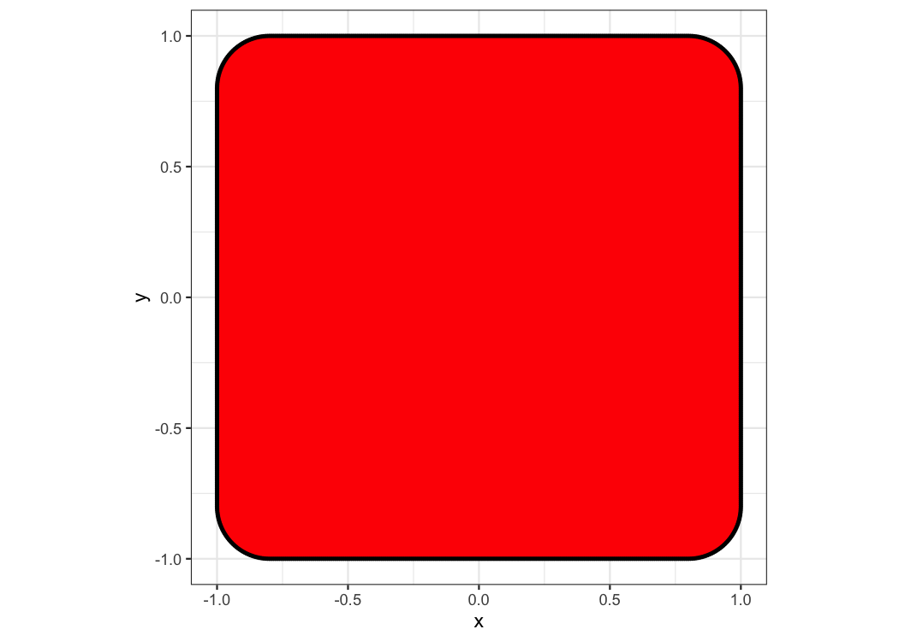
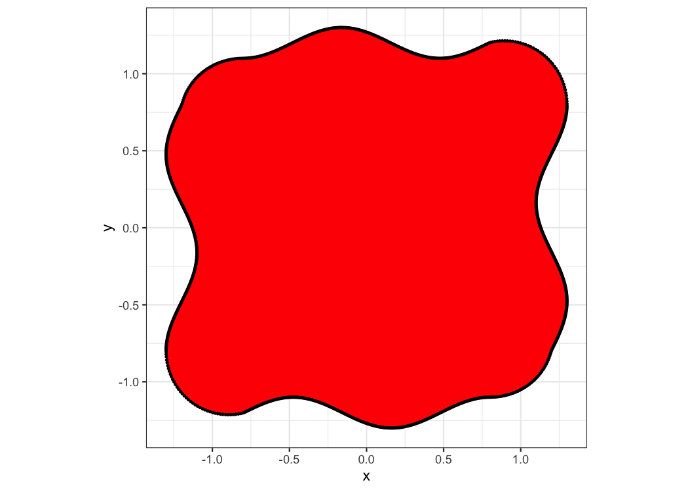
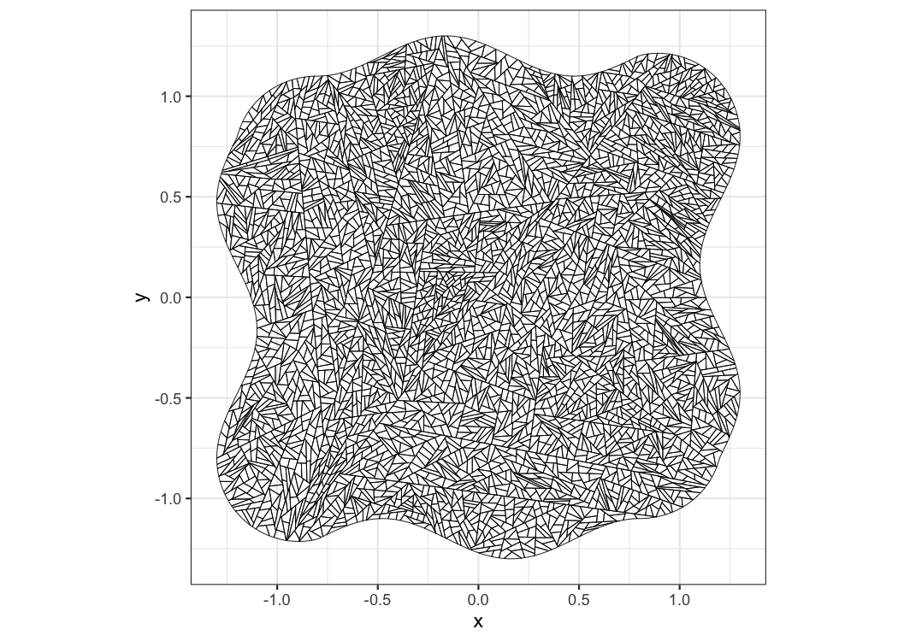
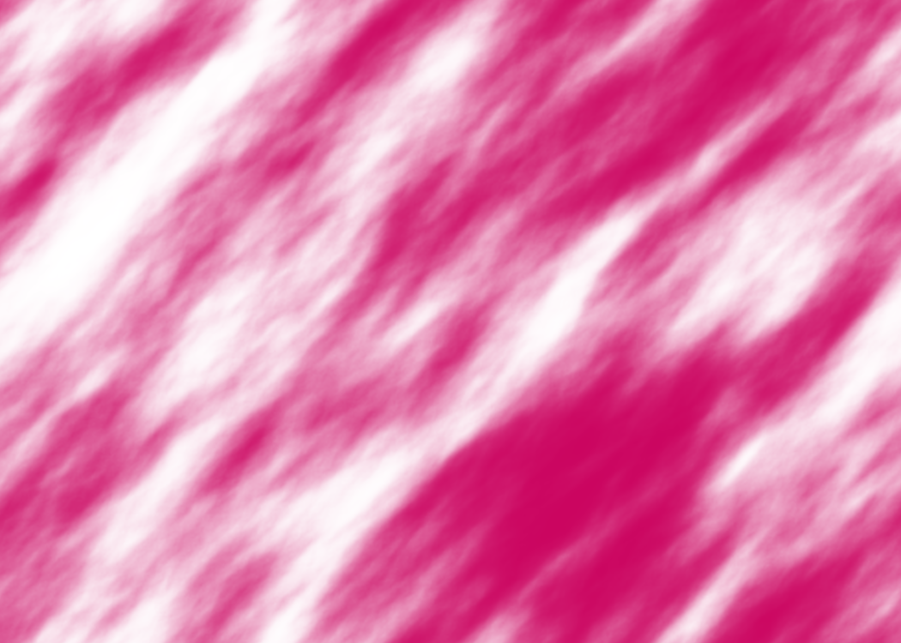

<!-- README.md is generated from README.Rmd. Please edit that file -->

# artKIT


## Overview

artKIT is an R package that includes a number of functions that are
useful when creating visual/generative art. At the moment, most of the
package deals with polygons/shapes, exposing functions that allows the
user to do operations such as boundary interpolation, corner rounding,
deformation and geometric subdivison/splitting. There are also functions
for rescaling values and creating images based on functions that map
pixel locations to colors.

The package is well-documented, and every function has both examples of
usage and descriptions of functionality, parameters and return value.

Vectorization is used throughout the package, leading to efficient
functions.

artKIT is a work in progress, and will be updated as soon as more
functions are ready. If you discover any issues or bugs, [please let me
know](https://github.com/mathiasisaksen/artkit/issues/new).

## Installation

The package can be installed by using the function `install_github` from
`devtools`:

``` r
devtools::install_github("mathiasisaksen/artKIT")
```

## Summary of content

We’ll start with the functions that deal with polygons:

-   `interpolate_polygon`: Takes in a polygon and returns a function
    that interpolates the boundary of the polygon. This is useful for
-   `round_polygon_corners`: Takes in a polygon and corner radius
    values, and returns a smoothed version of the polygon where the
    corners have been replaced by circular arcs (see the red shape in
    the logo)
-   `deform_polygon`: Takes in a polygon and the amount of deformation
    to apply to each vertex, and returns a deformed version of the
    polygon (see the cyan shape in the logo)
-   `cut_polygons`: Takes in one or more polygons and the number of
    times the polygons are to be subdivided/cut in half, and returns the
    cut polygons (see the black and white shape in the logo)
-   `transition_between_polygons`: Takes in two polygons and
    interpolates/transitions between them
-   `generate_random_polygon`: Generates a random polygon using polar
    coordinates
-   `rotate_polygon`: Takes in one or more polygons, the amount each
    polygon is to be rotated and the centers of rotation, and returns
    the rotated polygons
-   `compute_polygon_area`: Takes in one or more polygons and computes
    their areas
-   `compute_polygon_centroid`: Takes in one or more polygons and
    computes their centroids
-   `compute_polygon_perimeter`: Takes in one or more polygons and
    computes their perimeters
-   `compute_regular_polygons`: Computes one or more regular polygons
    with specified centers, circumradiuses and number of edges
-   `rounded_rectangle`: Creates a rectangle with rounded corners
-   `rounded_regular_polygon`: Creates a regular polygon with rounded
    corners

The remaining functions are the following:

-   `image_from_function`: Takes in a function that maps 2D locations to
    colors, and writes a PNG image based on this
-   `normalize_vectors`: Takes in one or more vectors and normalizes
    their lengths to 1
-   `minmax_scaling`: Rescales a vector of numbers to specified lower
    and upper bounds
-   `uniform_scaling`: Transforms a vector of numbers to be uniformly
    distributed on the interval \[0, 1\]

## Usage

The documentation for a given function can be found by writing, for
example, `?round_polygon_corners`. Writing
`example("round_polygon_corners")` lets you interactively run the code
examples in the documentation.

Here are a couple of demonstrations of how the package can be used.

### Example of polygon functions

In this example we start with a square and end up with a deformed shape
cut into many pieces.

First, we create a data frame for the square:

``` r
# Data frame containing the vertices of the square
vertex.df = data.frame(x = c(1, -1, -1, 1), y = c(1, 1, -1, -1))

library(ggplot2)
# Plot showing the square and its vertices
ggplot()+
  geom_polygon(data = vertex.df, aes(x = x, y = y), fill = "red")+
  geom_point(data = vertex.df, aes(x = x, y = y), color = "black", size = 0.5)+
  coord_fixed()
```

<!-- -->

The polygon is shown in red, and the vertices are shown as black points.

Next, we round the corners of the square.

``` r
library(artKIT)
rounded.df = round_polygon_corners(vertex.df, corner.radius = 0.2)
print(nrow(rounded.df))
## [1] 100
```

This replaces every vertex with a circular arc, and the result is a
smooth shape:

``` r
ggplot()+
  geom_polygon(data = rounded.df, aes(x = x, y = y), fill = "red")+
  geom_point(data = rounded.df, aes(x = x, y = y), color = "black", size = 0.5)+
  coord_fixed()
```

<!-- -->

While rounding the corners of the polygon before deformation is not
required, it usually leads to better results (see example 2 under
`?deform_polygon` for deformation without rounding).

The rounded polygon contains 100 vertices, and these are all located
along the corners. Before we deform it, we should resample points more
evenly along the boundary:

``` r
# Resample 1000 points along the boundary
num.vertices = 1000
# Get num.vertices + 1 evenly placed values between 0 and 1, remove the latter since
# 0 and 1 correspond to the first vertex
interp.time = seq(0, 1, length.out = num.vertices + 1)[-(num.vertices + 1)]
# Create interpolation function and evaluate it at interp.time
resample.df = interpolate_polygon(rounded.df)(interp.time)

ggplot()+
  geom_polygon(data = resample.df, aes(x = x, y = y), fill = "red")+
  geom_point(data = resample.df, aes(x = x, y = y), color = "black", size = 0.5)+
  coord_fixed()
```

<!-- -->

That looks better! `interpolate_polygon` returns a function that
interpolates the boundary of the polygon. The function takes in values
between 0 and 1, and maps these to locations on the boundary. When the
input is 0, the position of the first vertex is returned. 0.5 gives the
position halfway around the perimeter, and 1 closes the loop by again
giving the position of the first vertex.

Next, we deform the resampled polygon. This is done using the function
`deform_polygon`, which moves every vertex a specified distance. A
positive distance moves the vertex “outwards”, while a negative distance
moves it “inwards”. We define `deform.function`, which gives every
vertex a deform distance between 0.1 and 0.3.

``` r
deform.function = function(t) 0.1 + (0.3 - 0.1)*(1 + cos(6*2*pi*t))/2
deform.distance = deform.function(interp.time)

deform.df = deform_polygon(resample.df, deform.distance)

ggplot()+
  geom_polygon(data = deform.df, aes(x = x, y = y), fill = "red")+
  geom_point(data = deform.df, aes(x = x, y = y), color = "black", size = 0.5)+
  coord_fixed()
```

<!-- -->

It’s important to use a periodic function when computing the deform
distance. Otherwise, there will be a gap between the first and the last
vertex.

Next, we’ll cut the shape into many small pieces using the function
`cut_polygons`. At each iteration, it cuts every piece along a randomly
generated line, and the total number of polygons will, at minimum, be
doubled.

``` r
cut.df = cut_polygons(deform.df, number.of.iterations = 12, seed = 123)

ggplot()+
  geom_polygon(data = cut.df, aes(x = x, y = y, group = group), 
               fill = NA, color = "black", size = 0.2)+
  coord_fixed()
```

<!-- -->

## Example of `image_from_function`

In this simple example, we use a 2D noise function from the package
[GRFics](https://github.com/mathiasisaksen/GRFics) combined with
`image_from_function` to create a PNG image.

We start out by setting up the GRF object:

``` r
library(GRFics)
grf.object = generate.grf.object(
  x.lower = -1.4, x.upper = 1.4, y.lower = -1, y.upper = 1, 
  resolution.x = 490, resolution.y = 350,
  range.parameter = 0.3, direction.parameter = pi/4,
  strength.parameter = 3,
  function.names = "color.value"
)
```

We use the rectangle (-1.4, 1.4) x (-1, 1) as our plot area, leading to
an aspect ratio of 14:10. The GRF object contains one noise function
named `color.value`.

Next, we set up the color function that will be passed to
`image_from_function`. This function is expected to take in the
positions of the pixels and return one color per pixel. The vector
`colors` contains the colors we use in the image, and `color.ramp`
interpolates between these colors. `color.function` first computes a
value between 0 and 1 for each pixel, using the noise function
`color.value`. Then, these values are plugged into `color.ramp`, which
returns the colors in matrix format. Finally, we divide by 255 to get
RGB components between 0 and 1.

``` r
colors = c("#cb0560", "#ffffff")
color.ramp = colorRamp(colors)
color.function = function(locations) {
  color.value = evaluate.grf(locations, grf.object, function.name = "color.value",
                             rescale.method = "uniform")
  rgb.matrix = color.ramp(color.value) / 255
  return(rgb.matrix)
}
```

In `image_from_function`, the size of the output image is specified with
`width` and `height`. The parameter `bounds` determines the bounds of
the rectangular grid that the pixels are placed in.

``` r
image_from_function(
  filename = "image.png", 
  color.function = color.function, 
  bounds = c(-1.4, 1.4, -1, 1),
  width = 1050, height = 750,
)
```


